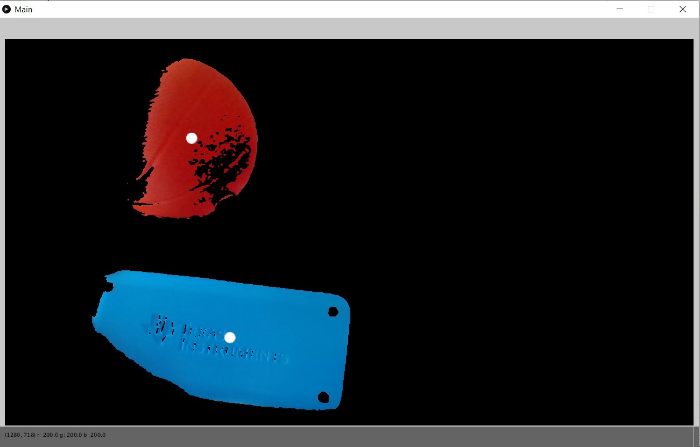

# Colored Object Tracker
- Implements a *K-means Clustering algorithm* to track different colored objects

- Desired colors are set to white and everything else is set to black

- Image is filtered using
  - *matrix convolution with box blur*
  - and then *sharpened with a threshold*
  
- Desired colors (white parts) are returned to their original color when displayed
  
- Circle is drawn on the centers of the clusters

Framework to implement webcam written by David Dobervich and is **NOT included**
